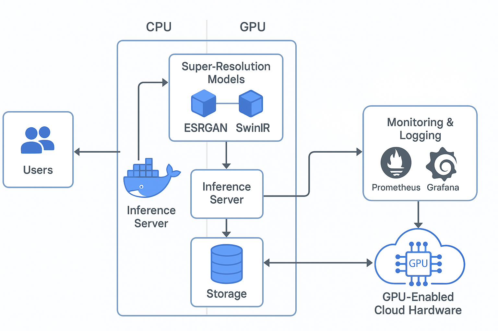

## AI-Driven Image Enhancement for Restoring Low-Quality Images to High Resolution

In today's digital landscape, the proliferation of low-quality images due to compression, aging, and bandwidth limitations presents a significant challenge. Existing solutions for enhancing low-quality images often suffer from poor scalability and limited restoration fidelity—especially when dealing with highly degraded content such as old photographs or heavily compressed media. This results in loss of valuable visual information and negatively impacts applications in personal heritage preservation, e-commerce, journalism, and social media.

### Value Proposition

**Current Business or Service Status Quo:**  
Today, platforms and services dealing with images—such as digital archives, e-commerce platforms, and media companies—typically rely on basic interpolation techniques or manual editing to upscale or enhance low-resolution images. These traditional methods struggle to reconstruct fine-grained details, often leading to blurry results and considerable time investment.

**Proposed System's Value Proposition:**  
The proposed machine learning system leverages state-of-the-art deep learning models for super-resolution, such as ESRGAN and SwinIR, to automatically restore and enhance low-quality images to high-resolution versions. By providing high-fidelity, real-time image enhancement, this system will help preserve visual content quality, extend the usability of degraded images, and improve user experience across multiple industries.

**Business Metrics:**  
The success of our AI-Driven Image Enhancement System will be evaluated using the following key performance indicators (KPIs):

* **Peak Signal-to-Noise Ratio (PSNR):** Achieve at least 28 dB on standard benchmarks like DIV2K validation set.

* **Structural Similarity Index (SSIM):** Maintain an SSIM score above 0.85 to ensure perceptual quality.

* **Real-Time Processing:** Ensure image restoration completes within 1 second for images up to 1080p resolution.

* **Operational Efficiency:** Measure system uptime, scalability, and maintenance efficiency in production environments.

## Potential Customers & Business Applications

Our system is designed to address the growing demand for high-quality image content restoration across various industries:

### 1. Personal Heritage & Photo Restoration

**Companies like MyHeritage and Photomyne:** Restore old, degraded family photographs into high-quality digital assets.

### 2. E-commerce Platforms

**Shopify, Etsy sellers:** Enhance low-quality product images to boost sales and improve product presentation.

### 3. Media & Journalism
**Getty Images, Shutterstock:** Automatically upscale old archives or field-reported compressed images.

### 4. Social Media & User-Generated Content
**Instagram, Facebook:** Improve visual quality of user-uploaded compressed or resized images.

### 5. Mobile OEMs and Camera Manufacturers
**OPPO, Vivo, Samsung:** Integrate real-time enhancement into photo post-processing pipelines.

By integrating our system into these industries, we can provide a scalable, real-time solution that maximizes the value of visual assets and significantly improves digital experiences.

<!-- 
Discuss: Value proposition: Your will propose a machine learning system that can be 
used in an existing business or service. (You should not propose a system in which 
a new business or service would be developed around the machine learning system.) 
Describe the value proposition for the machine learning system. What’s the (non-ML) 
status quo used in the business or service? What business metric are you going to be 
judged on? (Note that the “service” does not have to be for general users; you can 
propose a system for a science problem, for example.)
-->

### Contributors

<!-- Table of contributors and their roles. 
First row: define responsibilities that are shared by the team. 
Then, each row after that is: name of contributor, their role, and in the third column, 
you will link to their contributions. If your project involves multiple repos, you will 
link to their contributions in all repos here. -->

| Name           | Responsible for                         | Link to their commits in this repo          |
|----------------|-----------------------------------------|---------------------------------------------|
| Jingwen Lu     | Model Training                          | [Commits](https://github.com/Phase1es2/ML-Sys-DevOps/commits?author=lululu-mia)                              |
| Xiaoyan Ouyang | Model Deployment and Monitoring         | [Commits](https://github.com/Phase1es2/ML-Sys-DevOps/commits?author=Phase1es2 )                             |
| Yang Hao       | Data Pipeline Implementation            | [Commits](https://github.com/Phase1es2/ML-Sys-DevOps/commits?author=Stephenieoo)   

### System diagram

<!-- Overall digram of system. Doesn't need polish, does need to show all the pieces
Must include: all the hardware, all the containers/software platforms, all the models, 
all the data. -->

The system consists of multiple components ensuring seamless image restoration and deployment:

- **Data Sources:** Low-resolution and high-resolution image pairs from datasets like DIV2K, Set5, Set14, and BSD100.  
- **Model Training:** Fine-tuning pre-trained ESRGAN and SwinIR models on large-scale super-resolution datasets.  
- **Model Serving:** Deployment via API-based services using FastAPI or Flask for real-time inference.
- **Monitoring and Feedback:** Continuous system performance monitoring using Prometheus and Grafana to detect anomalies and trigger model retraining if needed.
- **Cloud Infrastructure:** Managed Kubernetes clusters and Docker containers for scalable deployment.
- **Data Pipeline:** ETL processes (using Apache Airflow) for periodic dataset augmentation and retraining.

### Summary of outside materials

<!-- In a table, a row for each dataset, foundation model. 
Name of data/model, conditions under which it was created (ideally with links/references), 
conditions under which it may be used. -->

| Resource       | How it was created                                                                                                    | Conditions of use                                 | Size / Hyperparameters                            |
|----------------|------------------------------------------------------------------------------------------------------------------------|---------------------------------------------------|--------------------------------------------------|
| DIV2K Dataset  | High-res images degraded to create LR-HR pairs [DIV2K Dataset](https://data.vision.ee.ethz.ch/cvl/DIV2K/) | Research use only                                 | 800 training images, 2K resolution             |
| Set5/Set14/BSD100       | Standard Super-Resolution Test Sets [Set5/Set14/BSD100](https://github.com/jbhuang0604/SelfExSR/tree/master/data) | Research use only                                       | 	Small benchmark sets         |
| ESRGAN Model      | Pre-trained on DIV2K and Flickr2K  [ESRGAN Model](https://github.com/xinntao/ESRGAN)                                                                    | Open-source for academic and commercial use       | 43M parameters                     |
| SwinIR Model   | Pre-trained on ImageNet for image classification [SwinIR Model](https://github.com/JingyunLiang/SwinIR)                                                                    | Open-source for academic and commercial use       | Variable depending on SwinIR variant |

### Summary of infrastructure requirements

<!-- Itemize all your anticipated requirements: What (`m1.medium` VM, `gpu_mi100`), 
how much/when, justification. Include compute, floating IPs, persistent storage. 
The table below shows an example, it is not a recommendation. -->

| Requirement       | Quantity & Duration                                     | Justification                                          |
|-------------------|---------------------------------------------------------|-------------------------------------------------------|
| `m1.medium` VMs   | 3 (entire project duration)                             | For data processing and model training                |
| `gpu_mi100`       | 4-hour block (twice a week)                             | GPU-accelerated deep learning training                |
| Floating IPs      | 1 (entire project duration) + 1 (sporadic use)          | For external access and testing                       |
| Persistent Storage| 100GB                                                  | Storing training data, models, and logs               |

### Detailed design plan

<!-- In each section, you should describe (1) your strategy, (2) the relevant parts of the 
diagram, (3) justification for your strategy, (4) relate back to lecture material, 
(5) include specific numbers. -->

#### Model training and training platforms

**Strategy:**  
- Utilize pre-trained ESRGAN and SwinIR models.
- Fine-tune models on DIV2K and additional custom low-resolution datasets.
- Apply transfer learning techniques to adapt to real-world compressed image scenarios.
- Use TensorFlow or PyTorch on cloud-based GPU instances.

**Justification:**  
- ESRGAN and SwinIR represent state-of-the-art approaches in super-resolution tasks.
- Transfer learning accelerates training and improves model generalization.
- High-fidelity output is critical for customer-facing applications.

**Implementation Details:**  
- **Training Duration:** Approximately 100,000 iterations or until validation loss convergence.
- **Evaluation Metrics:** PSNR and SSIM scores on validation datasets.
  
<!-- Make sure to clarify how you will satisfy the Unit 4 and Unit 5 requirements, 
and which optional "difficulty" points you are attempting. -->

#### Model serving and monitoring platforms

<!-- Make sure to clarify how you will satisfy the Unit 6 and Unit 7 requirements, 
and which optional "difficulty" points you are attempting. -->

**Strategy:**  
- Deploy trained models as web APIs using FastAPI for low-latency, scalable inference.
- Use Prometheus and Grafana for system performance monitoring.

**Justification:**  
- FastAPI supports high-throughput, real-time processing needs.
- Real-time monitoring helps ensure reliability and identify model drift early.

**Implementation Details:**  
- **Target Throughput:** 500+ images per minute.
- **Response Time:** Less than 1 second per image (up to 1080p resolution).

#### Data pipeline

<!-- Make sure to clarify how you will satisfy the Unit 8 requirements,  and which 
optional "difficulty" points you are attempting. -->

**Strategy:**  
- Establish an ETL pipeline using Apache Airflow to automate image ingestion, preprocessing (downscaling to simulate low-resolution input), and periodic retraining.

**Justification:**  
- Continuous updates improve model robustness against varied image degradations.
- Automation reduces operational overhead.

**Implementation Details:**  
- **Dataset Updates:** Scheduled every two weeks.  
- **Model Retraining:** Triggered based on monitored performance thresholds.

<!-- Make sure to clarify how you will satisfy the Unit 3 requirements,  and which 
optional "difficulty" points you are attempting. -->
#### Continuous Integration and Deployment (CI/CD)

**Strategy:**  
- Implement GitLab CI/CD pipelines to automate model testing, training, validation, and deployment.
- Use Docker containers to ensure reproducible environments across development, testing, and production.
  
**Justification:**  
- Automated pipelines maintain system quality and accelerate delivery cycles.
- Containerization simplifies model updates and scaling.

**Implementation Details:**  
- **Automated Testing:** 95%+ coverage targeted.
- **Deployment Triggers:** Any new model version must pass all CI/CD checks before going live.

### Related Work

Single image super-resolution has been extensively studied in recent years. For example, the NTIRE 2017 challenge introduced standardized datasets and baselines for SISR [1, 2]. Follow-up work in 2018 extended the benchmarks and reported improved results [3].

### References
#### Dataset

[1] Agustsson, E., & Timofte, R. (2017). NTIRE 2017 Challenge on Single Image Super-Resolution: Dataset and Study. CVPR Workshops.

[2] Timofte, R., Agustsson, E., Van Gool, L., Yang, M.-H., Zhang, L., Lim, B., et al. (2017). NTIRE 2017 Challenge on Single Image Super-Resolution: Methods and Results. CVPR Workshops.

[3] Timofte, R., Gu, S., Wu, J., Van Gool, L., Zhang, L., Yang, M.-H., Haris, M., et al. (2018). NTIRE 2018 Challenge on Single Image Super-Resolution: Methods and Results. CVPR Workshops.

[4] Ignatov, A., Timofte, R., et al. (2019). PIRM Challenge on Perceptual Image Enhancement on Smartphones: Report. ECCV Workshops.

[5] Huang, J.-B., Singh, A., & Ahuja, N. (2015). Single Image Super-Resolution From Transformed Self-Exemplars. In Proceedings of the IEEE Conference on Computer Vision and Pattern Recognition (CVPR), pp. 5197–5206.
