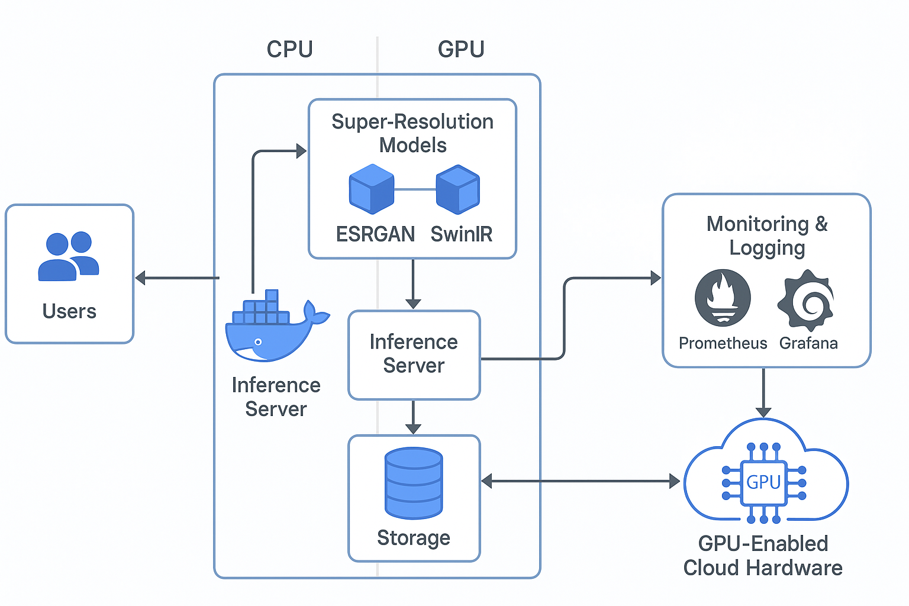

## AI-Driven Image Detection for Identifying Fake vs Real Images

In today's digital landscape, distinguishing between real and AI-generated images presents a significant challenge. Existing automated detection systems often suffer from low accuracy—especially when faced with sophisticated deepfake techniques. This leads to reliance on manual reviews and traditional tools that are slow and error-prone, ultimately diminishing user trust and safety on social media and content platforms.

### Value Proposition

**Current Business or Service Status Quo:**  
Content platforms currently depend on traditional image verification methods that are either manually intensive or based on outdated automated detection systems. These methods struggle against increasingly advanced AI-generated images, leading to higher error rates and delays in content moderation.

**Proposed System's Value Proposition:**  
The proposed machine learning system leverages large-scale deep learning models and state-of-the-art computer vision techniques to differentiate AI-generated images from real images with high accuracy. By providing real-time, highly accurate image classification, this system will enhance content moderation and flag potentially deceptive AI-generated content, thereby improving user trust and safety.

**Business Metrics:**  
- **Accuracy Rate:** Minimum of 95% classification accuracy in distinguishing real from AI-generated images.  
- **Real-Time Processing:** Image classification in less than 1 second per image.  
- **Reduced False Positives/Negatives:** Optimized to minimize incorrect classifications.  
- **Operational Efficiency:** High system uptime, scalability, and ease of maintenance.

<!-- 
Discuss: Value proposition: Your will propose a machine learning system that can be 
used in an existing business or service. (You should not propose a system in which 
a new business or service would be developed around the machine learning system.) 
Describe the value proposition for the machine learning system. What’s the (non-ML) 
status quo used in the business or service? What business metric are you going to be 
judged on? (Note that the “service” does not have to be for general users; you can 
propose a system for a science problem, for example.)
-->

### Contributors

<!-- Table of contributors and their roles. 
First row: define responsibilities that are shared by the team. 
Then, each row after that is: name of contributor, their role, and in the third column, 
you will link to their contributions. If your project involves multiple repos, you will 
link to their contributions in all repos here. -->

| Name           | Responsible for                         | Link to their commits in this repo          |
|----------------|-----------------------------------------|---------------------------------------------|
| Jingwen Lu     | Model Training                          | [Commits](https://github.com/Phase1es2/ML-Sys-DevOps/commits?author=lululu-mia)                              |
| Yang Hao       | Model Deployment and Monitoring         | [Commits](https://github.com/Phase1es2/ML-Sys-DevOps/commits?author=Phase1es2 )                             |
| Xiaoyan Ouyang | Data Pipeline Implementation            | [Commits](https://github.com/Phase1es2/ML-Sys-DevOps/commits?author=Stephenieoo)   

### System diagram

<!-- Overall digram of system. Doesn't need polish, does need to show all the pieces
Must include: all the hardware, all the containers/software platforms, all the models, 
all the data. -->

The system consists of multiple components ensuring seamless image detection and deployment:

- **Data Sources:** Collection of real and AI-generated images (e.g., CIFake, Deepfake datasets).  
- **Model Training:** Fine-tuning deep learning models such as ResNet and EfficientNet on large datasets.  
- **Model Serving:** Deployment via API-based services using FastAPI or Flask for real-time inference.  
- **Monitoring and Feedback:** Continuous performance monitoring (e.g., via Prometheus and Grafana) to detect model drift and trigger retraining as needed.  
- **Cloud Infrastructure:** Utilization of managed Kubernetes clusters and Docker containers for scalable deployment.  
- **Data Pipeline:** ETL processes (using tools like Apache Airflow) for periodic dataset updates to maintain model accuracy.

### Summary of outside materials

<!-- In a table, a row for each dataset, foundation model. 
Name of data/model, conditions under which it was created (ideally with links/references), 
conditions under which it may be used. -->

| Resource       | How it was created                                                                                                    | Conditions of use                                 |
|----------------|-----------------------------------------------------------------------------------------------------------------------|---------------------------------------------------|
| CIFake Dataset | Collection of real and AI-generated images from sources such as [CIFake Dataset](https://www.kaggle.com/datasets/birdy654/cifake-real-and-ai-generated-synthetic-images/data) | Research use only                                 |
| ResNet-50      | Pre-trained on ImageNet for image classification                                                                      | Open-source for academic and commercial use       |
| EfficientNet   | Pre-trained on ImageNet for image classification                                                                      | Open-source for academic and commercial use       |

### Summary of infrastructure requirements

<!-- Itemize all your anticipated requirements: What (`m1.medium` VM, `gpu_mi100`), 
how much/when, justification. Include compute, floating IPs, persistent storage. 
The table below shows an example, it is not a recommendation. -->

| Requirement       | Quantity & Duration                                     | Justification                                          |
|-------------------|---------------------------------------------------------|-------------------------------------------------------|
| `m1.medium` VMs   | 3 (entire project duration)                             | For data processing and model training                |
| `gpu_mi100`       | 4-hour block (twice a week)                             | GPU-accelerated deep learning training                |
| Floating IPs      | 1 (entire project duration) + 1 (sporadic use)          | For external access and testing                       |
| Persistent Storage| 100GB                                                  | Storing training data, models, and logs               |

### Detailed design plan

<!-- In each section, you should describe (1) your strategy, (2) the relevant parts of the 
diagram, (3) justification for your strategy, (4) relate back to lecture material, 
(5) include specific numbers. -->

#### Model training and training platforms

**Strategy:**  
- Utilize pre-trained models such as ResNet-50 and EfficientNet, fine-tuned on the CIFake dataset.  
- Apply transfer learning techniques to optimize these models for detecting AI-generated images.  
- Train models on cloud-based GPU instances using TensorFlow or PyTorch.

**Justification:**  
- ResNet-50 and EfficientNet are state-of-the-art models for image classification.  
- Fine-tuning these models on a domain-specific dataset enhances their ability to detect fake images.  
- Transfer learning reduces computational costs and training time compared to building models from scratch.

**Implementation Details:**  
- **Training Duration:** Approximately 20 epochs with learning rate adjustments based on convergence.  
- **Evaluation Metrics:** Validation accuracy and loss will be used to measure performance.

<!-- Make sure to clarify how you will satisfy the Unit 4 and Unit 5 requirements, 
and which optional "difficulty" points you are attempting. -->

#### Model serving and monitoring platforms

<!-- Make sure to clarify how you will satisfy the Unit 6 and Unit 7 requirements, 
and which optional "difficulty" points you are attempting. -->

**Strategy:**  
- Deploy the trained model as a web API using FastAPI or Flask to enable real-time image classification.  
- Monitor system performance using tools like Prometheus and Grafana to track response times and accuracy.

**Justification:**  
- FastAPI offers high-performance asynchronous processing, ideal for real-time inference.  
- Real-time monitoring ensures that any performance issues or model drifts are quickly detected and addressed.

**Implementation Details:**  
- **Target Throughput:** At least 500 requests per minute.  
- **Response Time:** Each image should be classified in under 1 second.

#### Data pipeline

<!-- Make sure to clarify how you will satisfy the Unit 8 requirements,  and which 
optional "difficulty" points you are attempting. -->

**Strategy:**  
- Establish an ETL pipeline using Apache Airflow to automate data ingestion, transformation, and model retraining.  
- Regularly update datasets with new images to ensure the model remains accurate against emerging deepfake techniques.

**Justification:**  
- Automating the data pipeline reduces manual intervention and ensures up-to-date training data.  
- Continuous updates help improve model generalizability and robustness.

**Implementation Details:**  
- **Dataset Updates:** Scheduled every two weeks.  
- **Model Retraining:** Triggered by significant data changes or when performance drift is detected.

<!-- Make sure to clarify how you will satisfy the Unit 3 requirements,  and which 
optional "difficulty" points you are attempting. -->
#### Continuous Integration and Deployment (CI/CD)

**Strategy:**  
- Implement GitLab CI/CD pipelines to automate testing, training, and deployment processes.  
- Use Docker containers to ensure consistency across development, testing, and production environments.

**Justification:**  
- Automated pipelines ensure that every change undergoes rigorous testing, maintaining high model quality.  
- Docker standardizes the runtime environment, reducing deployment-related issues.

**Implementation Details:**  
- **Automated Testing:** Aim for at least 95% test coverage.  
- **Deployment Triggers:** Any model update or bug fix must pass CI/CD pipelines before being deployed.

