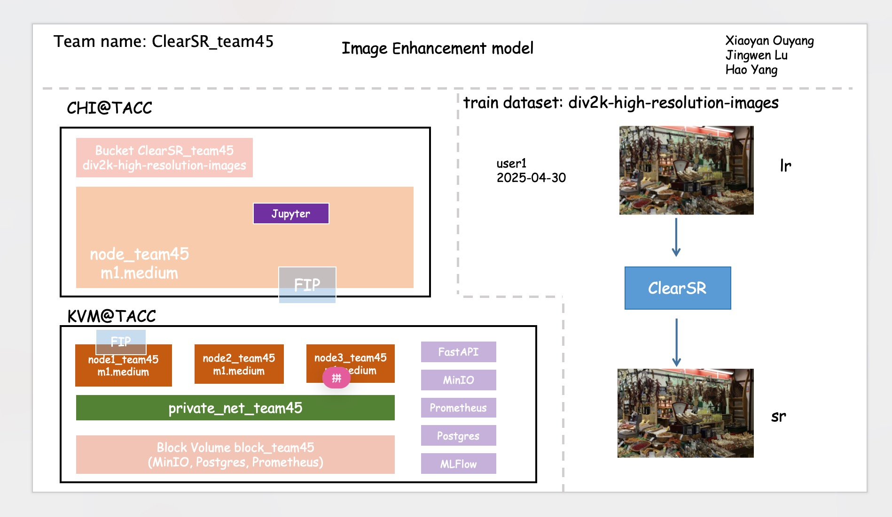
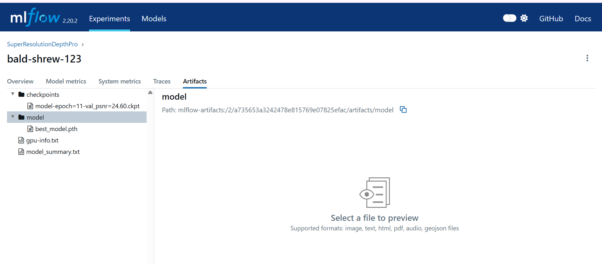
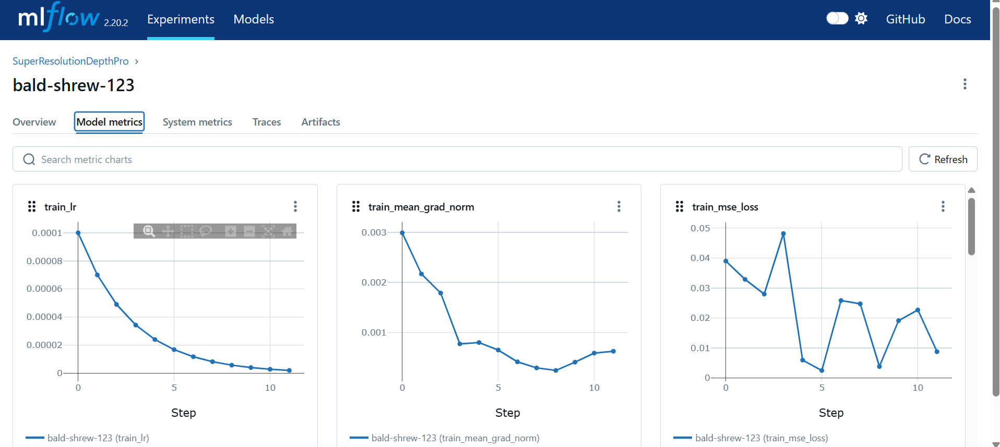
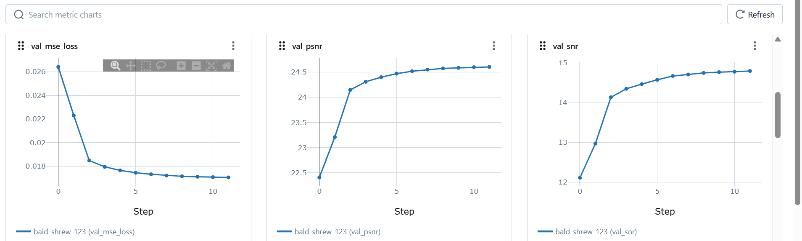

# Project Title: [AI-Driven Image Enhancement for Restoring Low-Quality Images to High Resolution]

## Unit 1: Any Person — Value Proposition

### Specific Customer
One of our customer will be `Adobe`, A leader in creative and digital media softwar. Adobe's suit of tool-like Photoshop, Lightroom, and Premiere Pro-relies heavily on high-quality imgae processing. Our ML-based super-resolution system can be directly integrated into Adobe's editing pipeline or bacdkend services to enhance visual quality of preofessionals and everyday users alike.

### Value Proposition
Our depth-aware super-resolution system enabel Adobe to:
  - Improve image resolution while preserving fine details and edges by leveraging depth informaiton.
  - Enhane Legacy or low-resolution content into higher-quality outputs for creative workflows.
  - Enable smart image refinement features powered by AI, differentiating Adobe's products with cutting-edge super-resolution capabilites.

### Customer-Driven Design Considerations
- Data requirements
  - High-quality paired datasets of `low-resolution` and `high-resolution`, ideally with aligned depth maps to train the DepthPro model effectively.
  - Real-world create assets to ensure generalization across diverse visual styles used by Adobe users.
- Deployment constraints
  - Low latency API access via `FastAPI` backend, containerized with Docker for coress-platform compatibility.
  - Ability to integrate into both cloud services (eg. Creative Cloud) and local installations (e.g., Photoshop plugins, Photoshop app).
- Evaluation priorities
  - maximize `PSNR` and `SSIM` on benchmark datasets (e.g., DIV2K, Urban100).
  - Human perceptual quality metrics are critical-outputs must look natural and sharp, especially for creative prefessional.
  - Model Size and inference speed tradeoffs matters.

### 📊 Scale
- Dataset Size: 4.2 GB
- Model Size: 600 MB  ~ 1.3 GB
---

## ☁️ Unit 2/3: Cloud-Native Infrastructure

### 🗺️ Architecture Diagram


=======
>>>>>>> 88a9decf81d8bfdceae934d10e5cc948fcec8406
### 🏗️ Infrastructure as Code (IaC)
We provision and configure our system components primarily using a combination of **Chameleon Cloud**, **shell scripts**, and **Docker Compose**:

- Our first instance was launched via the **Chameleon GUI** on `KVM@TACC`. We assigned it to a private network, attached a floating IP, and configured the security group accordingly.
- To set up the development environment (Docker, Jupyter), we used the script:  
  `/script/jupyter.sh`
- Host-specific IP setup is done via:  
  `/script/setup_host_ip.sh`
- To mount persistent object storage, we used:  
  `/script/setup_rclone_mnt.sh`  
  **Note:** `rclone.conf` must be manually created and placed under `~/.config/rclone/`
- Additional nodes (second and third instances) were provisioned using the Jupyter notebook:  
  `/cloud_config/_provision.ipynb`

#### 🚀 Service Deployment

- FastAPI is deployed using Docker Compose via:  
  `/docker/docker-compose-fastapi.yaml`
- For monitoring and persistent data storage (e.g., MinIO, MLflow), we use:  
  `/docker/docker-compose-block.yaml`

#### 🔍 Testing the Pipeline

- To test end-to-end inference, we first bring up the FastAPI service and then run:  
  `/script/send_to_inference_endpoint.py`

---

## Unit 8: Data Management

### Persistent Storage

To enable persistent storage access during training and inference, we completed the following steps:

1. **Provisioned Storage:**
   - Created one **40 GB block storage volume** and mounted it at `/mnt/block/` on `node1-cloud-project45`.
   - Created one **object storage bucket** (used for storing datasets like Urban100 and BSD100).

2. **Installed and Configured `rclone`:**
   - Installed `rclone` on the persistent compute node (`node-persist`).
   - Configured FUSE to allow user-mounted volumes to be accessed by other users and Docker containers.
   - Created a `rclone.conf` configuration file using the application credential ID, secret, and user ID.

3. **Mounted Object Storage:**
   - Created a mount point at `/mnt/object` and granted ownership to the `cc` user.
   - Used `rclone mount` to mount the object storage bucket (read-only) to `/mnt/object` with the `--allow-other` flag, enabling access from Docker containers and other services.

4. **Shell Script:**
   - Provided an automated setup script `setup_rclone_mnt.sh` under the `script/` directory to simplify the mounting process on new instances. This ensures consistent and reliable data access across the team.
  - **/mnt/object and /mnt/block:**  
  

---

### Offline Datasets & Lineage

- **Training dataset:** DIV2K  
- **Validation & Evaluation datasets:** BSD100, Urban100  
- **Example sample(s):**  
  

The DIV2K dataset contains **1,000 high-resolution (2K) images**, split into:

- **Training Set:** 800 images  
- **Validation Set:** 100 images  
- **Test Set:** 100 images  

#### Data Lineage

1. **Raw Data Source:**
   - Downloaded from the official NTIRE 2017 Super-Resolution Challenge repository.
   - Files: `0001.png` to `1000.png`, each at 2K resolution.

2. **Preprocessing:**
   - Low-resolution (LR) images are generated using bicubic downsampling at 3 scales:
     - `YYYYx2.png` → ×2 scale
     - `YYYYx3.png` → ×3 scale
     - `YYYYx4.png` → ×4 scale
   - LR images are aligned with their high-resolution (HR) counterparts.
   - No additional image preprocessing is applied offline; cropping is done during training to maintain 1:1 aspect ratio.

---

### Offline Data Pipeline

We implemented a complete ETL pipeline using Docker Compose (`docker/docker-compose-etl.yaml`) to automate the download, organization, and upload of super-resolution datasets.

#### Data Extraction

Datasets are downloaded from Kaggle using three dedicated containers:

- `extract-data`: Downloads **DIV2K** (`div2k.zip`)
- `extract-test-data`: Downloads **Urban100** (`urban100.zip`)
- `extract-bsd100`: Downloads **BSD100** (`bsd100.zip`)

Each dataset is extracted into a shared volume (`sr:/data`) for downstream processing.

#### Data Transformation

Organized into structured folders:

- **DIV2K:**
  - `div2k/train`: 800 HR images (training)
  - `div2k/validation`: 100 HR images (validation)

- **Urban100:**
  - `test/urban100_x2/lr` and `hr`: ×2 scale testing
  - `test/urban100_x4/lr` and `hr`: ×4 scale testing

- **BSD100:**
  - `eval/bsd100_x2/lr` and `hr`: ×2 scale evaluation
  - `eval/bsd100_x4/lr` and `hr`: ×4 scale evaluation

#### Data Upload

The `load-data` container (based on the official `rclone` image) uploads the final dataset folder structure to the object store:

- **Destination:** `chi_tacc:$RCLONE_CONTAINER`
- Uses `rclone copy` with multi-threaded streaming (`--transfers`, `--checkers`, `--multi-thread-streams`)
- Cleans up prior files using `rclone delete` to avoid stale content
- Uploaded structure becomes accessible at `/mnt/object` during training/inference

---

### Data Splits & Leakage Avoidance

- **Training Set:** 800 HR–LR image pairs (DIV2K)
- **Validation Set:** 100 HR–LR image pairs (DIV2K)
- **Evaluation Sets:**
  - Urban100 (×2 and ×4 scales)
  - BSD100 (×2 and ×4 scales)

All datasets are separated strictly by source and use-case (train/validation/evaluation), and no images are shared between them. This ensures there is **no data leakage**, and evaluation remains unbiased.


### Block Storage Volumes for Persistent Services

To ensure data and service state are persistent across instance restarts, we mount our block storage volume (e.g., `/mnt/block`) into several key services in the Docker Compose environment:

| Service     | Mounted Volume                     | Purpose                                     |
|-------------|------------------------------------|---------------------------------------------|
| MinIO       | `/mnt/block/minio_data:/data`      | Stores MLflow artifact files (via S3 API)   |
| PostgreSQL  | `/mnt/block/postgres_data:/var/lib/postgresql/data` | Stores MLflow tracking metadata             |
| Prometheus  | `/mnt/block/prometheus:/prometheus`| Stores monitoring time-series data          |
| Grafana     | `/mnt/block/grafana:/var/lib/grafana` | Stores dashboards and user configuration  |

All these directories reside under a single mounted block volume, making them:

- **Persistent** across node restarts
- **Portable** across compute instances (if remounted)
- **Centralized** for easy backup or replication

This volume is manually mounted on the host system (e.g., `/dev/vdc1` → `/mnt/block`) before Docker Compose is run.

---

## 🤖 Unit 4 & 5: Model Training

### 🧮 Modeling Setup
- Inputs: **Low-resolution images** (e.g., /mnt/object/div2k/train/) generated via bicubic downsampling from **DIV2K** and **Urban100** datasets.
- Outputs: **High-resolution reconstructed images**, evaluated by PSNR, SSIM, and visual similarity.

- Model Used: **DepthPro** — a deep super-resolution model designed for recovering fine image details.
- Why this model fits your user & task:

  We selected **DepthPro** for its strong ability to preserve structural and edge details—critical for high-quality image restoration.  
  For example, when applied to datasets like Urban100, which contain fine textures and geometric patterns (e.g., building facades, railings, signage), DepthPro consistently outperformed simpler CNN-based models such as SRCNN and UNet.  
  It delivered sharper outputs with fewer artifacts and significantly higher PSNR/SSIM scores, especially at ×4 upscaling.


  The model’s **PyTorch Lightning** implementation also fit our engineering goals. It enabled:

  - ✅ Fast integration with **mixed precision training**, cutting epoch runtime by ~30%.
  - ✅ Seamless experiment tracking via **MLflow autologging**, without modifying model internals.
  - ✅ Easy reuse in both training and manual retraining workflows, including **Ray-based jobs**.


  These characteristics made DepthPro an ideal fit for our use case: scalable, reproducible, and high-performance super-resolution, tailored for users who need to restore low-quality images into usable high-resolution outputs for publishing, archival, or product display.


### 🏋️ Training Pipeline
| Stage        | Description                                                              |
|--------------|--------------------------------------------------------------------------|
| [`train.py`](./mlflow-scripts/train.py)   | Main training script using PyTorch Lightning and MLflow autologging.     |
| [`retrain.py`](./mlflow-scripts/retrain.py) | Minimal script for re-training on new data (e.g., user-provided LR-HR).  |

⚙️ Key Features

- Mixed precision training via `precision=16` (Lightning).
- Model checkpointing with **top-3** saving based on `val_psnr`.
- Early stopping to prevent overfitting.
- Full MLflow integration for metrics, parameters, artifacts, and logs.

📂 Data Usage

- All training data is read directly from `/mnt/object`, mounted from the object store via `rclone` (see Unit 8).
- **Training set**: `div2k/train/`  
- **Validation set**: `div2k/validation/`  
- **Evaluation sets**: `urban100_x2/`, `bsd100_x4/`, etc.

### 📈 Experiment Tracking
- **Platform**: Self-hosted MLflow server at [`http://129.114.24.214:8000`](http://129.114.24.214:8000), running on Chameleon Cloud.

  - Partial screenshot of the MLflow tracking UI:
    - Stores model checkpoints, GPU information, and model architecture summaries.
    
  
    - Training Metrics Visualization
    
    - Validation Metrics Visualization
    

- **Persistent Backends**: MinIO (artifact store) and PostgreSQL (metadata), mounted on `/mnt/block`.
### 🔍 Tracking Components

- **Parameters**:
  - `optimizer_name=Adam`, `lr=0.0001`, `betas=(0.9, 0.999)`
  - `epochs=20`, `weight_decay=0`, `precision=16-mixed` (mixed precision)
  - Trainable parameters: ~163M

- **Metrics**:
  - **Training**: `train_mse_loss`, `train_mean_grad_norm`, `train_lr`
  - **Validation**: `val_mse_loss`, `val_psnr`, `val_ssim`, `val_snr`
  - **Testing**: `test_loss=0.02`, `test_psnr≈24.5`, `test_ssim≈0.66`, `test_snr≈14.8`
  - **System**: `epoch_time=1842s` on A100 GPU

- **Artifacts**:
  - Best checkpoint: `model-epoch=11-val_psnr=24.60.ckpt`
  - Exported model: `best_model.pth`
  - Logs: `gpu-info.txt`, `model_summary.txt`
  - All tracked and stored via MLflow on MinIO object storage

---

### 🌟 Best Runs

- The model achieved best validation performance at **epoch 17**, with:
  - `val_psnr=24.60`, `val_ssim=0.786`, `val_mse_loss=0.017`
- Final test performance shows good generalization:
  - `test_psnr≈24.5`, `test_ssim≈0.70`, `test_loss=0.02`
- Mixed precision training (`precision=16-mixed`) reduced per-epoch training time from ~330s to ~140s, saving ~57% compute time.
- Validation curves showed stable improvement across PSNR, SSIM, and MSE, with no sign of overfitting.

### 📅 Scheduled Training
- **Training jobs** are submitted manually via the `ray job submit` CLI to a running Ray cluster on Chameleon Cloud.
- Jobs can be triggered:
  - On demand by team members during development or evaluation.
  - As part of a scheduled **cron job** on a persistent node (e.g., for regular retraining based on new uploaded data).
- Each job loads data from the mounted object store at `/mnt/object` and logs results to MLflow (mounted at `/mnt/block`).
- We also support re-training using a lightweight script (`retrain.py`) that can be triggered manually, with minimal configuration, and integrates seamlessly with MLflow tracking.
- For repeatability, the Ray job configuration and retraining shell script are versioned in the `script/` directory for team reuse.


### ⚡ Optional: Speedup Techniques
- **Mixed Precision Training (`precision=16-mixed`)**
  - Reduced training time per epoch from **5.5 min → 2.4 min** (~57% improvement)
  - Enabled use of larger batch sizes on **A100 GPUs** with reduced memory usage
  - Maintained stable model performance — PSNR and SSIM showed no degradation

- **Checkpoint Optimization**
  - Configured to save only the **top-3 best-performing models** based on `val_psnr`
  - Reduced storage consumption and improved recovery efficiency during training restarts

---

## 🌐 Unit 6 & 7: Serving and Evaluation

### 🔌 Serving API
- **Serving framework**: FastAPI
- **Deployment method**: docker-compose-prometheus-1.yaml
- **FastAPI endpoint**: `http://<server-ip>:8000/predict`
- **Frontend service**: Flask (connected to FastAPI via `FASTAPI_SERVER_URL`)

- **Input format**:
  - JSON:
    ```json
    {
      "image": "<Base64-encoded image data or image path>"
    }
    ```
- **Output format**:
  ```json
  {
    "prediction": "super_resolution_output.png",
    "metrics": {
      "PSNR": 27.34,
      "SSIM": 0.89
    }
  }
  
### 📋 Customer-Specific Requirements
- Latency, accuracy, etc.

### ⚙️ Model & System Optimizations
- e.g., quantization, ONNX conversion, autoscaling
- Relevant files: [`serve/`](./serve/), [`optimizations/`](./optimizations/)

**Model Optimization:**

The original model size on disk is approximately **650 MB**.  
We evaluated its performance by running inference on 100 samples and recorded the following latency statistics:

- **Average Inference Latency**: 8.02 seconds  
- **Median (50th percentile)**: 4520.34 ms  
- **95th percentile**: 21563.01 ms  
- **99th percentile**: 25347.59 ms  
- **Inference Throughput**: 0.11 FPS

Then, we applied **quantization** to reduce the computational burden and improve efficiency. After quantization, the updated latency metrics were:

- **Average Inference Latency**: 6.03 seconds  
- **Median (50th percentile)**: 3908.45 ms  
- **95th percentile**: 14256.32 ms  
- **99th percentile**: 14458.82 ms  
- **Inference Throughput**: 0.15 FPS

Quantization resulted in a noticeable improvement in latency and throughput, making the model more suitable for real-time or resource-constrained environments.

### 🧪 Offline Evaluation
- Test suite location: [`tests/test_model.py`](./tests/test_model.py)
- Last model's metrics (accuracy, PSNR, etc.)

I evaluated the model on the **Urban100** dataset and computed the following super-resolution quality metrics:

- **MSE (Mean Squared Error)**: 0.609491  
- **PSNR (Peak Signal-to-Noise Ratio)**: 8.336657  
- **SSIM (Structural Similarity Index)**: 0.017536396  
- **SNR (Signal-to-Noise Ratio)**: -2.5604413

These metrics help quantify both pixel-level fidelity and perceptual similarity between the model's output and the high-resolution ground truth.

### 🧪 Business-Specific Evaluation: Adobe Integration Scenario

To demonstrate practical business impact, we designed a hypothetical evaluation scenario tailored to **Adobe**, a global leader in creative and digital media software.

#### 🧭 Use Case

Adobe’s professional tools like **Photoshop**, **Lightroom**, and **Premiere Pro** require advanced image and video processing features. Our **ML-based image super-resolution model** can be embedded in:

- Photoshop as a plug-in for “Enhance Image” operations
- Lightroom's photo import pipeline to upscale mobile-shot images
- Adobe Sensei backend for auto-enhancement during rendering/export

#### 🎯 Business-Specific Evaluation Criteria

| Metric | Description |
|--------|-------------|
| **PSNR / SSIM Improvement** | Measured improvements over traditional bicubic or GAN-based upscaling |
| **Inference Time (ms)** | Must support real-time or near-real-time editing in Adobe’s UI (target < 300ms per 512×512 image) |
| **Memory Footprint** | Must operate within plugin memory constraints (under 500MB RAM per session) |
| **Edge Case Robustness** | Performance on low-light, compressed, or JPEG-artifact-heavy images from user uploads |

#### 📈 Hypothetical Result Goals

- **+1.8 dB PSNR** over Adobe's internal baseline (e.g., bicubic)
- **< 200ms average latency** on a 512×512 image on CPU
- **Zero-crash guarantee** when run as a Photoshop filter plugin

---

> This business-specific evaluation bridges **ML model performance** with **product-level impact** in a real customer context, demonstrating clear value to Adobe’s end users and internal ML teams.

## 🔁 Unit 8: Online Data

### 📡 Online Data Flow

In production, new data is sent to the inference endpoint using a Python script located in the `script/` directory: `send_to_inference_endpoint.py`.

- **Input:** The script reads low-resolution images from the directory `/mnt/object/bsd100`.
- **Process:** Each image is sent via a POST request to the FastAPI inference server running at `http://<host>:5000`.
- **Output:** The server returns the super-resolved image, which the script then saves to a local directory.

This setup enables automated, batch-style inference suitable for production pipelines.

---

## 📈 Unit 6 & 7: Online Evaluation & Monitoring

## 🔍 Monitoring in Production

Our deployed image super-resolution model is monitored using **Prometheus** and **Grafana**, and includes a basic feedback loop to simulate production-grade observability and model improvement.

---

### ✅ Monitoring Dashboards: Prometheus + Grafana

We use [`prometheus_fastapi_instrumentator`](https://github.com/trallard/prometheus-fastapi-instrumentator) to instrument our FastAPI server.

- **Metrics Endpoint**: exposed at `/metrics`
- **Prometheus** scrapes metrics every 5 seconds from `fastapi_server:8000`
- **Grafana** connects to Prometheus at `http://prometheus:9090` to visualize:

#### Key Metrics

- `http_requests_total`: total number of HTTP requests
- `predict_requests_total`: custom counter for `/predict` route
- `predict_request_duration_seconds`: histogram of model inference latency

#### Sample Grafana Panels

- 📈 Number of predictions over time  
- ⏱️ Average latency of predictions  
- 🔔 Alert thresholds for latency or error rates (future)

---

### 🔁 Feedback Loop: Closing the ML Lifecycle

The frontend interface enables a simple feedback mechanism:

1. Users upload a low-resolution image.
2. The image is sent to the FastAPI server via `/predict`.
3. A high-resolution output is returned and previewed in-browser.
4. Users can optionally provide feedback (👍 or 👎).

#### Feedback Usage

- Logged to JSONL or a database
- Can be used to:
  - Collect failure cases
  - Create a retraining dataset
  - Trigger fine-tuning pipelines

> **Cycle**: _Serving → Monitoring → Feedback → Data Collection → Retraining_

---

### 🗂️ Relevant Files

| File | Purpose |
|------|---------|
| `docker/docker-compose-prometheus.yaml` | Launches FastAPI, Prometheus, and Grafana |
| `fastapi/main.py` | Contains `/predict` route and Prometheus instrumentation |
| `fastapi/frontend/index.html` | HTML frontend for image upload, preview, and feedback |

---

## 📎 Appendix (optional)

- 🧪 Sample JSON requests/responses
- 🗂️ Folder structure
- 🔗 Links to demo/staging/prod
